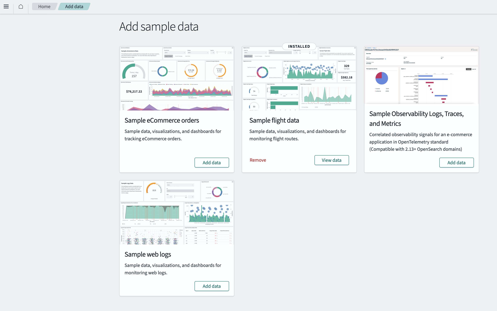
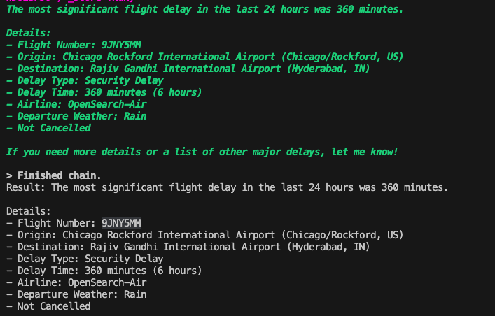

# OpenSearch MCP Server

A Model Context Protocol (MCP) server for OpenSearch that provides seamless integration between LangChain agents and OpenSearch, enabling natural language search and data analysis capabilities.

## 1. Getting Started

OpenSearch MCP Server provides the following key features:

- **Natural Language Search**: Perform OpenSearch queries using natural language through GPT models
- **Index Management**: List indices, view mapping information, and manage data structures
- **Real-time Search**: Convert complex search queries from natural language to OpenSearch queries
- **Docker-based Deployment**: Easy installation and execution through docker-compose

### Prerequisites

- Docker and Docker Compose
- Python 3.10+ (for running the agent)
- OpenAI API key (for GPT model usage)

## 2. Architecture

```
OpenSearch MCP Server
├── opensearch/              # OpenSearch configuration files
│   └── opensearch.yml       # OpenSearch configuration
├── scripts/                 # Initialization scripts
│   └── enable-mcp-server.sh # MCP server activation script
├── agents/                  # LangChain agents
│   ├── agent.py            # Main agent script
│   ├── requirements.txt    # Python dependencies
│   └── .env               # Environment variables
├── img/                    # Documentation images
│   └── screenshot.png      # Example screenshot
├── docker-compose.yml      # Docker Compose configuration
└── Dockerfile             # Custom OpenSearch image
```

### Service Components

- **OpenSearch**: Search engine (port 9200)
- **OpenSearch Dashboards**: Web UI (port 5601)
- **MCP Server**: Bridge between OpenSearch and LangChain
- **LangChain Agent**: Natural language processing agent

## 3. Installation

### Docker Environment Setup

```bash
# Clone the repository
git clone https://github.com/capelabs/opensearch-mcp-server.git
cd opensearch-mcp-server

# Start services with Docker Compose
docker-compose up -d
```

### Python Agent Environment Setup

```bash
cd agents

# Create and activate virtual environment (recommended)
python -m venv venv
source venv/bin/activate  # Linux/Mac
# or venv\Scripts\activate  # Windows

# Install dependencies
pip install -r requirements.txt
```

### Environment Variables Configuration

Set your OpenAI API key in the `agents/.env` file:

```env
OPENAI_API_KEY=your_openai_api_key_here
```

## 4. Usage

### 1. Starting Services

```bash
# Start all services with Docker Compose
docker-compose up -d

# Check service status
docker ps
```

### 2. Verify MCP Server Status

After OpenSearch is fully started, the MCP server will be automatically activated. You can verify this with the following commands:

```bash
# Check OpenSearch cluster settings
curl -X GET "localhost:9200/_cluster/settings?pretty"
```

### 3. Accessing OpenSearch Dashboards & Add Sample Data

Open a web browser and navigate to `http://localhost:5601` to open the OpenSearch dashboard and add sample data.
You can add any sample data you like, In this case `Sample flight data` in this README.



### 4. Running the LangChain Agent

```bash
cd agents
python agent.py
```

### 5. Natural Language Search

Once the agent is running, you can ask questions in natural language:

```
Input: Show me all indices
Input: What's the mapping for the user index?
Input: Find users where name is "john"
Input: Search for logs from the last 24 hours
```



### Available MCP Tools

1. **ListIndexTool**: Retrieve list of all indices
2. **IndexMappingTool**: Get mapping information for specific indices
3. **SearchIndexTool**: Execute complex search queries

## 5. Contributing

We welcome contributions to the project! Please follow these steps:

### Development Environment Setup

```bash
# Fork and clone the repository
git clone https://github.com/your-username/opensearch-mcp-server.git
cd opensearch-mcp-server

# Create a development branch
git checkout -b feature/your-feature-name
```

### Code Style Guidelines

- Python code should follow PEP 8 style guidelines
- Docker-related files should include clear comments
- New features should be submitted with appropriate test code

### Pull Request Process

1. Write clear commit messages describing your changes
2. Update documentation for new features
3. Ensure all tests pass
4. Create a Pull Request and request review

### Issue Reporting

Please submit bugs or feature requests through GitHub Issues. Include the following information:

- Clear description of the issue
- Steps to reproduce
- Expected vs actual results
- Environment information (OS, Docker version, etc.)

## 6. Additional Information

### License

This project is distributed under the MIT License.

### Troubleshooting

#### OpenSearch Connection Failed

```bash
# Check OpenSearch container logs
docker-compose logs opensearch

# Check for port conflicts
netstat -tulpn | grep :9200
```

#### MCP Server Activation Failed

```bash
# Restart MCP activation script
docker-compose restart enable_mcp_server
```

#### Python Agent Errors

```bash
# Reinstall dependencies
pip install --upgrade -r requirements.txt

# Verify OpenAI API key
echo $OPENAI_API_KEY
```

### Performance Optimization

- For large datasets, adjust JVM heap memory size in `opensearch.yml`
- Enable security plugins for production environments
- Optimize index shard and replica settings

### Additional Resources

- [OpenSearch Official Documentation](https://opensearch.org/docs/)
- [LangChain MCP Adapters](https://github.com/langchain-ai/langchain-mcp-adapters)
- [Model Context Protocol Specification](https://modelcontextprotocol.io/)

### Contact

For questions or suggestions, please reach out through GitHub Issues.
